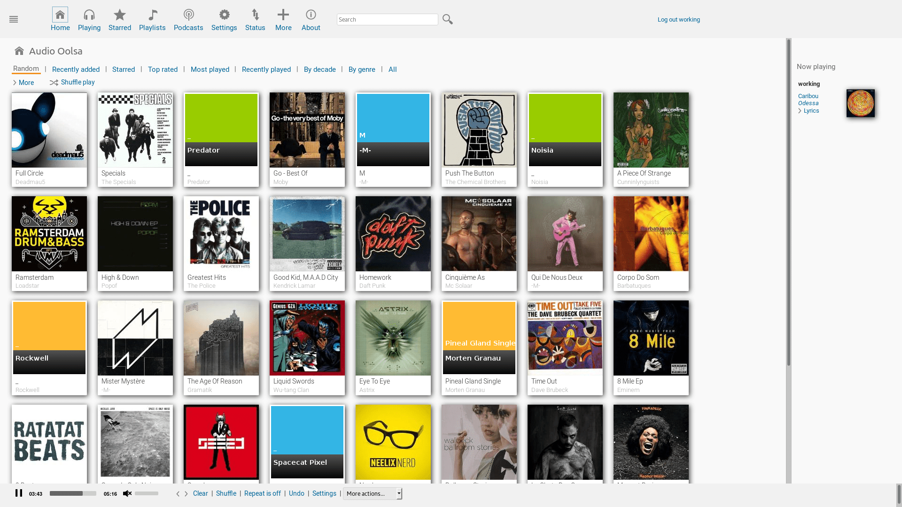

<!--
N.B.: This README was automatically generated by https://github.com/YunoHost/apps/tree/master/tools/README-generator
It shall NOT be edited by hand.
-->

# Airsonic-Advanced for YunoHost

[](https://dash.yunohost.org/appci/app/airsonic)  

[](https://install-app.yunohost.org/?app=airsonic)

*[Lire ce readme en français.](./README_fr.md)*

> *This package allows you to install Airsonic-Advanced quickly and simply on a YunoHost server.
If you don't have YunoHost, please consult [the guide](https://yunohost.org/#/install) to learn how to install it.*

## Overview

Airsonic-Advanced is a more modern implementation of the Airsonic fork with several key performance and feature enhancements. It adds and supersedes several features in Airsonic.

Airsonic is a free, web-based media streamer, providing ubiquitous access to your music. Use it to share your music with friends, or to listen to your own music while at work. You can stream to multiple players simultaneously, for instance to one player in your kitchen and another in your living room.

Airsonic is designed to handle very large music collections (hundreds of gigabytes). Although optimized for MP3 streaming, it works for any audio or video format that can stream over HTTP, for instance AAC and OGG. By using transcoder plug-ins, Airsonic supports on-the-fly conversion and streaming of virtually any audio format, including WMA, FLAC, APE, Musepack, WavPack and Shorten.

If you have constrained bandwidth, you may set an upper limit for the bit rate of the music streams. Airsonic will then automatically re sample the music to a suitable bit rate.

In addition to being a streaming media server, Airsonic works very well as a local jukebox. The intuitive web interface, as well as search and index facilities, are optimized for efficient browsing through large media libraries. Airsonic also comes with an integrated Podcast receiver, with many of the same features as you find in iTunes.


**Shipped version:** 11.0.0~ynh4

## Screenshots



## Documentation and resources

* Official admin documentation: <https://airsonic.github.io/docs/>
* Upstream app code repository: <https://github.com/airsonic-advanced/airsonic-advanced>
* YunoHost documentation for this app: <https://yunohost.org/app_airsonic>
* Report a bug: <https://github.com/YunoHost-Apps/airsonic_ynh/issues>

## Developer info

Please send your pull request to the [testing branch](https://github.com/YunoHost-Apps/airsonic_ynh/tree/testing).

To try the testing branch, please proceed like that.

``` bash
sudo yunohost app install https://github.com/YunoHost-Apps/airsonic_ynh/tree/testing --debug
or
sudo yunohost app upgrade airsonic -u https://github.com/YunoHost-Apps/airsonic_ynh/tree/testing --debug
```

**More info regarding app packaging:** <https://yunohost.org/packaging_apps>
