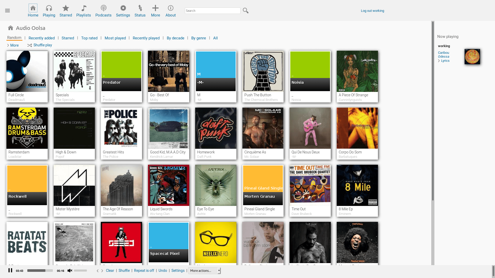

<!--
To README zostało automatycznie wygenerowane przez <https://github.com/YunoHost/apps/tree/master/tools/readme_generator>
Nie powinno być ono edytowane ręcznie.
-->

# Airsonic-Advanced dla YunoHost

[](https://ci-apps.yunohost.org/ci/apps/airsonic/)


[](https://install-app.yunohost.org/?app=airsonic)

*[Przeczytaj plik README w innym języku.](./ALL_README.md)*

> *Ta aplikacja pozwala na szybką i prostą instalację Airsonic-Advanced na serwerze YunoHost.*  
> *Jeżeli nie masz YunoHost zapoznaj się z [poradnikiem](https://yunohost.org/install) instalacji.*

## Przegląd

Airsonic-Advanced is a more modern implementation of the Airsonic fork with several key performance and feature enhancements. It adds and supersedes several features in Airsonic.

Airsonic is a free, web-based media streamer, providing ubiquitous access to your music. Use it to share your music with friends, or to listen to your own music while at work. You can stream to multiple players simultaneously.

Airsonic is designed to handle very large music collections (hundreds of gigabytes). Although optimized for MP3 streaming, it works for any audio or video format that can stream over HTTP, for instance AAC and OGG. By using transcoder plug-ins, Airsonic supports on-the-fly conversion and streaming of virtually any audio format, including WMA, FLAC, APE, Musepack, WavPack and Shorten.

If you have constrained bandwidth, you may set an upper limit for the bit rate of the music streams. Airsonic will then automatically re sample the music to a suitable bit rate.

In addition to being a streaming media server, Airsonic works very well as a local jukebox. The intuitive web interface, as well as search and index facilities, are optimized for efficient browsing through large media libraries. Airsonic also comes with an integrated Podcast receiver, with many of the same features as you find in iTunes.


**Dostarczona wersja:** 11.0.0~ynh5

## Zrzuty ekranu



## Dokumentacja i zasoby

- Oficjalna dokumentacja dla administratora: <https://airsonic.github.io/docs/>
- Repozytorium z kodem źródłowym: <https://github.com/airsonic-advanced/airsonic-advanced>
- Sklep YunoHost: <https://apps.yunohost.org/app/airsonic>
- Zgłaszanie błędów: <https://github.com/YunoHost-Apps/airsonic_ynh/issues>

## Informacje od twórców

Wyślij swój pull request do [gałęzi `testing`](https://github.com/YunoHost-Apps/airsonic_ynh/tree/testing).

Aby wypróbować gałąź `testing` postępuj zgodnie z instrukcjami:

```bash
sudo yunohost app install https://github.com/YunoHost-Apps/airsonic_ynh/tree/testing --debug
lub
sudo yunohost app upgrade airsonic -u https://github.com/YunoHost-Apps/airsonic_ynh/tree/testing --debug
```

**Więcej informacji o tworzeniu paczek aplikacji:** <https://yunohost.org/packaging_apps>
